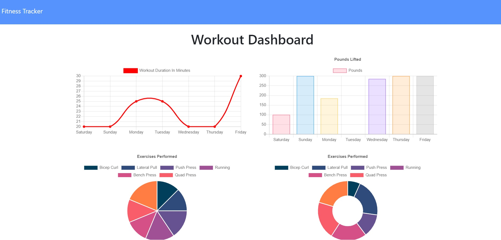

# DailyWorkoutTracker

## Contents

1. [Technologies-Used](#Technologies-Used)
2. [Description](#Description)
3. [Deploy](#Link)
4. [Usage](#Usage)
5. [License](#License)
6. [Credits](#Credits)
7. [Contributing](#Contributing)
8. [Questions](#Questions)

## Technologies-Used

1. Javascript
2. Node.js
3. Node packages
   - express
   - mongoose
   - morgan
4. MongoDB / mongoDB ATLAS
5. Heroku

## Description

- An Application that can save daily workout plans. Also, user able to see the last workout they have done. Dashboard section shows the 7 days workout history of the user.

## Deployed application link

- [Deployed Link](https://fitness-tracker-with-mongodb.herokuapp.com/)

## Usage

- User needs to create a workout plan, and click in complete when they have done, it will show the last workout on the main page. If they click on the dashboard section, they will be taken to 7 days workout history with graphics.

- 
- 

## License

- 

## Credits

- Front End code was given by Triology, models/api routes/ deploy page / server connections created by Tolga Secme.

## Contributing

- No contributes.

##  Questions

- E-mail me for any questions [tolgasecme@icloud.com](mailto:tolgasecme@icloud.com)
- Also you can find me on Github [TolgaS92](https://github.com/TolgaS92).
